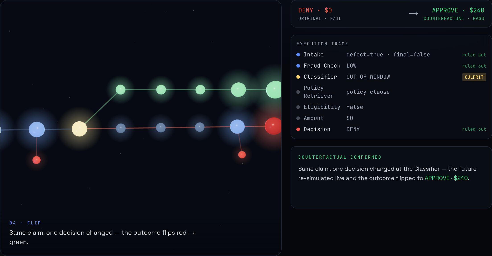
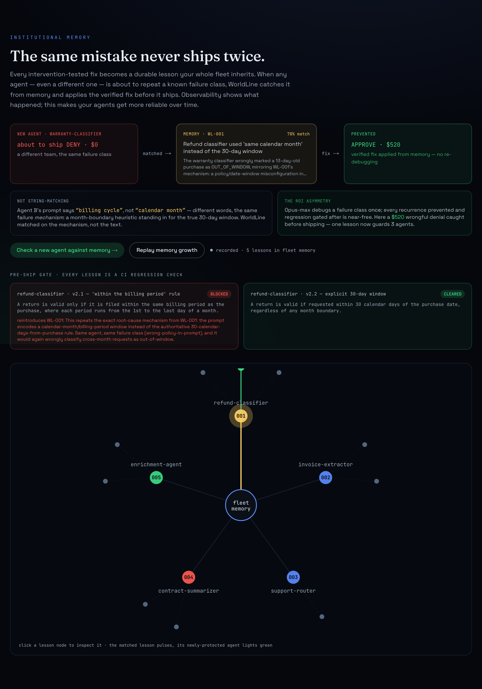

<div align="center">

# 🌐 WorldLine

### Counterfactual debugging **+ institutional memory** for multi-agent AI reliability

**Tracing shows what _happened_. WorldLine finds the decision that _caused_ the failure, proves the fix, and makes your agent fleet stop repeating it.**

[](https://claude-build-day-alpha.vercel.app)
&nbsp;
[](https://youtu.be/2jSkWQZ-EOE)
&nbsp;
[](https://www.anthropic.com)

<sub>Built at **Claude Build Day 2026** · `claude-opus-4-8` · Next.js 16 + react-three-fiber on Vercel</sub>

<br/>



</div>

---

## The problem

Multi-agent systems fail in non-deterministic, multi-step ways. When a 7-step pipeline returns the wrong answer, *which decision* caused it? Today you read traces and guess. Tracing shows **what happened**; replay **repeats** it; forking lets you **explore one alternate path** — but you still pick the checkpoint by hand, and **nothing proves the fix**. And when the fix lands, nothing stops a *different* agent from shipping the same class of bug next week.

## The reliability lifecycle

WorldLine runs an autonomous loop on top of replay/forking — every stage is real and demoed:

| | Stage | What Claude does |
|--|--|--|
| **1** | **Detect** | A multi-agent run returns the wrong outcome — treated as a signal, not a dead end. |
| **2** | **Attribute** | Audits **every decision in parallel** and **intervention-tests** each (fork → inject a counterfactual → re-simulate the tail **live**). Only the decision whose correction *flips the outcome* is the culprit — plausible decoys are exonerated. |
| **3** | **Repair** | (`effort=max`) names the root cause and rewrites the offending prompt. |
| **4** | **Verify** | Re-runs the whole workflow; a **deterministic code assertion** proves the flip — *not a model grading itself*. |
| **5** | **Remember** | The verified fix becomes a durable **lesson** in a fleet knowledge graph. |
| **6** | **Prevent** | A *different* agent about to repeat that failure class — **even worded differently** — is caught from memory and fixed before it ships. |
| **7** | **Gate** | Every lesson becomes a parallel CI check that **blocks** any candidate change that would reintroduce a known failure. |

## How WorldLine compares (the honest wedge)

Replay and checkpoint-forking already exist — we don't claim otherwise.

| Capability | Tracing<br/><sub>LangSmith/Phoenix</sub> | Replay/Fork<br/><sub>AgentOps/LangGraph</sub> | Evals<br/><sub>Judgment/Braintrust</sub> | **WorldLine** |
|---|:--:|:--:|:--:|:--:|
| Show what happened | ✓ | ✓ | ✓ | ✓ |
| Repeat / explore an alternate path | – | ✓ *(manual)* | – | ✓ |
| **Auto-find the culprit decision** (intervention-tested) | – | – | – | **✓** |
| **Author + verify a repair** (code assertion) | – | – | partial | **✓** |
| **Causal memory** — reuse a verified fix across agents | – | – | – | **✓** |
| **Pre-emptive prevention + pre-ship gate** | – | – | – | **✓** |

WorldLine's unit of memory is a **causal, intervention-tested, verified-repair lesson**, applied pre-emptively. *(We say "intervention-tested attribution," not "mathematical causality.")*

## Institutional memory — the same mistake never ships twice



A verified fix isn't a one-off — it's an asset. WorldLine matches new failures on **mechanism, not text**: a warranty agent whose prompt says *"billing cycle"* is matched to the refund lesson about *"calendar month"* (same month-boundary bug, different words) and repaired from memory — and the pre-ship gate **blocks a reworded regression** that re-encodes the same wrong policy. One Opus-`max` debug, then every recurrence prevented and regression gated for free.

## How it works — the golden scenario

A 7-step refund-adjudication pipeline (`intake → fraud → classify → policy → eligibility → amount → decision`) **denies a valid \$240 claim**. The bug is realistic and subtle: the **Classifier's** prompt encodes *"same calendar month"* instead of the true **30-day window**, so an in-window claim that crosses a month boundary is wrongly classified `OUT_OF_WINDOW` and denied.

- The auto-bisect intervention-tests all four LLM decisions **in parallel**. The last-touch **Decision** agent *looks* guilty (it's what said DENY) — but forcing it to `APPROVE` still pays **\$0** (the money is wrong upstream), so it's **exonerated**. Only correcting the **Classifier** flips the outcome → `APPROVE · $240`.
- The repair is verified by `decision==="APPROVE" && amount===240` on a full live re-run, then minted as lesson **WL-001** and applied to prevent a different agent's recurrence + gate a regression.

## Run it yourself

```bash
npm install
export ANTHROPIC_API_KEY=sk-ant-...   # your key (never commit it)

npm run prove          # terminal proof of the full loop (live Opus 4.8)
npm run prove:memory   # recurrence-prevention across a different agent
npm run prove:gate     # pre-ship gate blocks a reworded regression
npm test               # deterministic engine + memory tests (no tokens)
npm run dev            # the cinematic UI at http://localhost:3000
```

`npm run record` recaptures the instant-demo default (`lib/worldline/recorded*.ts`) from a fresh live run.

## Architecture

```
lib/worldline/
  engine.ts        7-step workflow · fork/replay (cached upstream, live downstream)
  bisect.ts        parallel auto-bisect · intervention-tested attribution + dead-ends
  repair.ts        diagnosis + repair (effort=max) + deterministic verifier
  knowledge.ts     lessons · causal memory match · recurrence prevention · pre-ship gate
  scenario.ts      golden refund scenario + the divergent-wording warranty agent
app/
  api/loop/route.ts     GET = recorded (instant) · POST = live re-run on Opus 4.8
  api/memory/route.ts   GET = recorded lessons/prevention/gate · POST = live
components/
  WorldlineCanvas.tsx   react-three-fiber dual-worldline 3D (label-free, dead-end branches)
  Panels.tsx            stage inspector + the auditable intervention table
  Memory.tsx · KnowledgeGraph.tsx   prevention flow + animated fleet knowledge graph
scripts/
  prove*.ts        terminal proofs · record.ts captures the demo default
  probe.mjs        Playwright visual+motion self-verify harness
```

## Verifiable "done"

8/8 tests green · live URL `200` · the loop recomputes live on prod (`POST /api/loop`) · graded against [`rubric.md`](./rubric.md), with UX gates checked by [`scripts/probe.mjs`](./scripts/probe.mjs) vs [`design-rubric.md`](./design-rubric.md). See [`brief.md`](./brief.md), [`demo-script.md`](./demo-script.md), and the [`session-log.md`](./session-log.md).

## Notes

All product code in this repo was built during Claude Build Day 2026. Harness/tooling skills under `.claude/skills/` are attributed in `.claude/skills/VENDORED.md`. Positioning is grounded against primary docs (LangGraph `updateState`, AgentOps, Arize/Phoenix, Judgment Labs) — see `brief.md`.
